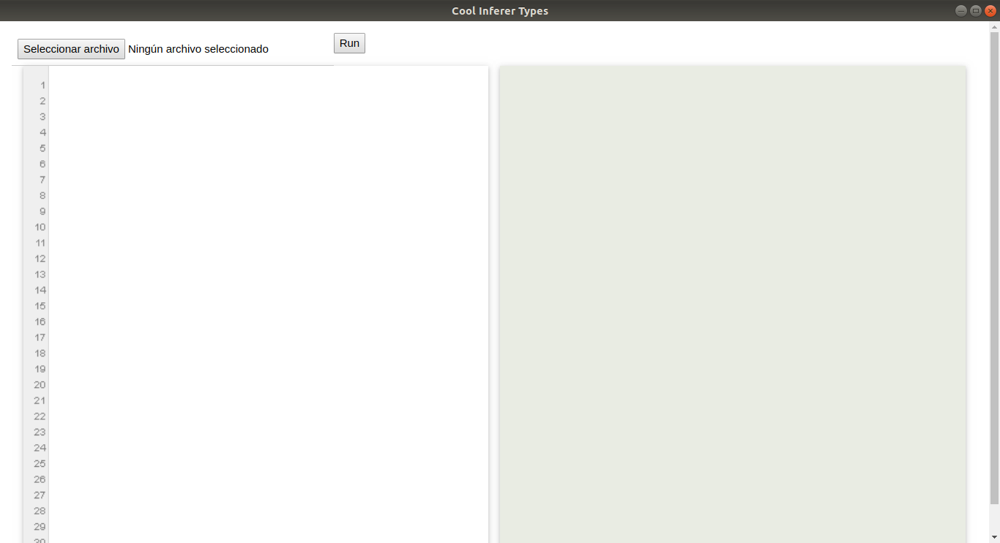

<div style="text-align: center;">

# Segundo proyecto de Compilación

## Inferencia de tipos en **Cool**

</div>

<br />

- José Carlos Hernández Piñera ..... C311
- Henry Estévez Gómez .............. C311

<br />

## Temario

- 1.Detalles técnicos
    - Dependencias del proyecto
    - Cómo ejecutarlo ?
- 2.Documentación acerca del desarrollo y funcionamiento del proyecto
    - Generación de tokens
    - Proceso de parsing
    - Recolección de tipos
    - Construcción de tipos
    - Chequeo de tipos
    - Inferencia de tipos


### 1.Detalles técnicos.

En el proyecto se usan pocos módulos de terceros, a continuación solo los enunciamos, más adelante en el documento se describe su funcinamiento, en caso de que consideremos que se hace necesario.

- pyl, en su versión 3.11
- eel, en su versión 0.0.14
- pipenv (se hace necesario tener instalado el módulo para ejecutar el entorno virtual)

#### Forma de ejecutar el proyecto:
Por el hecho de que usamos [_eel_](https://github.com/JCH97/Eel) para generar la interfaz visual del proyecto recomendamos que a la hora de ejecutar el mismo se tenga instalado _Chrome_ en la pc, ya que este paquete lo utiliza, en su configuración por defecto, para generar la aplicación.

- Abrir una terminal en la carpeta donde está ubicado el proyecto
- Ejecutar el entorno virtual
    ```bash
    ~$ pipenv shell
    ```
- Instalar las dependecias dentro del entorno virtual
    ```bash
    ~$ pipenv install --ignore-pipfile
    ```
- Navegar hasta la carpeta `src`
    ```bash
    ~$ cd src
    ```
- Ejecutar
    ```
    ~$ python .
    ```

Después de ejecutar los pasos que se describen arriba se nos presenta una ventana.



En la parte izquierda escribimos el código en _Cool_ o podemos cargarlo directamente desde un archivo `.cl` a través del botón `Seleccionar archivo` y en la parte derecha se presentan los resultados de la inferencia. Una vez que seleccionemos el archivo o lo escribamos, hacer clic en `Run`. 

Dentro de la carpeta del proyecto se exponen una serie de tests que pudieran contribir a las pruebas del mismo.

### 2.Documentación acerca del desarrollo y funcionamiento del proyecto.

El proceso de desarrollo de un compilador cuenta con varias fases o etapas que nos permiten conversión de un código de alto nivel a uno entendible por una computadora. Con el siguiente proyecto se pretende recoger de la mejor manera posible las primeras etapas dentro del mismo, para ello se transita por varias fases que permiten alcanzar el objetvo propuesto, dígase:
- Generación de tokens (análisis lexicográfico)
- Proceso de parsing (análisis sintáctico)
- Recolección de tipos
- Construcción de tipos
- Chequeo de tipos
- Inferencia de tipos

Para el desarrollo del proceso de generación de los tokens o análisis lexicográfico nos apoyamos en una librería de python, _ply_ para ser más precisos, pues dentro de sus bondades permite la realización de dicho cómputo, se utilizó esto además, pues este punto no es el fuerte del proyecto y se precisaba el ahorro de tiempo en el desarrollo a la vez que se aseguraba la correctitud de la implementación. La librería en cuestión se divide en dos módulos `lex.py` y `yacc.py`; el primero es que nos interesa en estos momentos. La identificación de los tokens se apoya en el análisis de una serie de reglas basadas en expresiones regulares, sería algo como lo que presentamos a continuación:

```python
def t_STRING(t):
    r'"[^\0\n"]*(\\\n[^\0\n"]*)*"'
    t.value = t.value[1:-1]
    return t
```

Para el correcto funcionamiento de este proceso, se hace necesario además, la definición previa del conjunto de las palabras reservadas del lenguaje, así como los símbolos presentes dentro de este.

Una vez aportados todos estos valores y las correspondientes expresiones regulares para la detección de los tokens se procede a la ejecución del siguiente método para completar el proceso.

```python
def tokenizer(code):
    lexer = lex.lex()
    lexer.input(code)

    tokens = []
    while True:
        token = lexer.token()
        if token is None:
            break
        tokens.append(Token(token.value, tokens_dict[token.type], token.lineno, find_column(code, token)))

    tokens.append(Token('$', CoolGrammar.EOF))

    return tokens
```

No se pretende hacer una análisis tan profundo del método empleado, sino, resumir las ideas más importantes dentro de este.

El proceso de parsing se realiza a través de un parser _LR1_, parser shift-reduce, que se apoya en una gramática previamete construida a través de la clase `Grammar` y una serie de métodos que posibilitan la interacción con la misma. 

Para definir los _no terminales_ se emplea el método `NonTerminal` cuando se utiliza para uno solo y `NonTerminals` cuando se quieren definir varios de una sola vez, ambos se encuentran dentro de la clase en cuestión.

```python
CoolGrammar = Grammar()
program = CoolGrammar.NonTerminal('<program>', startSymbol = True)
class_list, def_class = CoolGrammar.NonTerminals('<class-list> <def-class>')
```

Los _terminales_ cuentan con una sintaxis similar a la expuesta en arriba; para ellos existen las clases: `Terminal` y `Terminals`.

La gramática que se emplea es una gramática atribuida, por tanto a la derecha de cada producción se define una regla que se asocia a la misma y que posibilita la construcción del _AST_, que en definitiva es quien nos permitirá realiar todos los procesos que siguen a continuación.

```python
program %= class_list, lambda h, s: ProgramNode(s[1])
class_list %= def_class + class_list, lambda h, s: [s[1]] + s[2]
class_list %= def_class, lambda h, s: [s[1]]
```

#### Inferencia de tipos.

Para el algoritmo propuesto a la hora de inferir los tipos nos apoyamos en el _AST_ construido a partir del árbol de derivación y el uso de las gramáticas atribuidas, el recorrido por el _AST_ es sumamente importante por el hecho de que cada nodo representa un elemento sintácticamente distinto y además incluye todo lo necesario para evaluar la expresión o programa reconocido. Para realizar estos recorridos por el _AST_ vamos a apoyarnos en el patrón _visitor_ que nos ayuda en este sentido.

En principio realizamos cuatro pasadas sobre él que nos permiten realizr el proceso de inferencia. 

En una primer recorrido obtenemos todos los tipos presentes en el código, es decir analizamos todos los nodos de tipo `ClassDeclarationNode` que son lo que encierran dicho significado y comenzamos con la construcción del `Contexto`, que en este paso, nos permitirá detectar errores de redefinición de tipos; este contexto creado va a interactúar con cada una de las fases posteriores.

Una vez tengamos los tipos correctamente computados toca ahora construirlos; esta operación se encarga de agregar a cada tipo las fuciones que se definen a partir de él y los atributos que posee, o sea, una vez que tengamos todas las clases(que en definitiva representan los tipos definidos) pasamos a ver los métodos y los atribuitos declarados dentro de cada clase, los nodos de tipo `FuncDeclarationNode` y `AttrDeclarationNode` del _AST_ nos aportan dicha información, para cada método se almacena a través de la clase `Method`, que se encuentra en el módulo `semantic.py`, los parámetros que recibe así como el tipo de retorno de este y demás información que consideramos útil para futuras operaciones. 

```python
class Method:
    def __init__(self, name, param_names, params_types, return_type):
        self.name = name
        self.param_names = param_names
        self.param_types = params_types
        self.param_infos = [VariableInfo(f'_{name}_{pname}', ptype) for pname, ptype in zip(param_names, params_types)] 
        self.return_type = return_type
        self.return_info = VariableInfo(f'_{name}', return_type)

    def __str__(self):
        params = ', '.join(f'{n}: {t.name}' for n,t in zip(self.param_names, self.param_types))
        return f'[method] {self.name}({params}): {self.return_type.name};'

    def __eq__(self, other):
        return other.name == self.name and \
            other.return_type == self.return_type and \
            other.param_types == self.param_types
```

Lo mismo ocurre con cada atriuto definido.

```python 
class Attribute:
    def __init__(self, name, typex):
        self.name = name
        self.type = typex

    def __str__(self):
        return f'[attrib] {self.name}: {self.type.name};'

    def __repr__(self):
        return str(self)
```

Ambas clases detectan la redefinición de los atributos que describen y nos posibilitan futuras operaciones con los valores que son marcados como _AUTO\_TYPE_ que son en definitiva el motivo de nuestro proyecto.

El próximo paso en el camino hacia la inferencia es el chequeo de los tipos, en el chequeo se origina la creación de un _scope_ por cada nodo sintácticamente distinto, que por tanto encierra un significado dentro del _AST_, cada scope propicia la detección de errores e incongruencias dentro del código escrito en _Cool_, luego cada uno de ellos se usará en el proceso de la inferencia, al finalizar este paso cada nodo se encontrará marcado con su adecuado tipo estático según la expresión dentro de la que esté definido; estas son las dos principales funciones de esta fase, pasaremos a explicar el funcionamiento de la inferencia en sí.

Cunado llega el momento de inferir los tipos, ya se encuentran propiamente calculados cada uno de los aspectos antes mencionados, por lo que toca hacer el cuarto recorrido sobre el _AST_, para dejar todos los _AUTO\_TYPE_ resueltos; en realidad en la inferencia se realizará más de una pasada por el árbol, por el hecho de que para inferir se delega en todo momento la resposabilidad de determinar un tipo lo más abajo posible en el árbol y en cada recorrido que se haga se infieren tantos tipos como sea posible, es decir, cada vez que se pueda inferir el tipo de alguna variable se volverá a realizar un recorrido sobre el _AST_, pues puede darse el caso de que otras variables dependan de la que se acaba de determinar; creo que esto se ilustra mejor con un ejemplo; notar que los recorridos paran una vez que no se pueda inferir ningún tipo:

```typescript
class Main {
main(a: AUTO_TYPE, b: AUTO_TYPE, c: AUTO_TYPE): AUTO_TYPE {
        {
            b <- c;
            a <- b;
            c + 1;
            a;
        }
    };
};
```

Supongamos que tenemos el código de arriba, en este cada una de las variables presentes está tipada como _AUTO\_TYPE_, luego a la hora de inferir lo que marca la diferencia en la primera pasada es la expresion _c + 1_; la suma, en este caso, posibilita determinar el tipo de _c_;  _c_ dentro del _AST_ es de tipo `IdNode` y una vez dentro de él se conoce que este procede de una suma, luego esta solo se puede realizar entre dos enteros, por tanto de ahí inferimos el tipo de esa variable, pero las demás y el tipo de retorno de la función se quedan para otra ocasión, pues en esta primera no  era posible identficar las mismas, cuando se vuelva a realizar el recorrido como _c_ ya esta marcada como `int` entonces, cuando se analice la asignación `b <- c` se determina el tipo de _b_, lo mismo ocurre para _a_ y para el tipo de retorno de la función, este último depende del cuerpo del método y como el tipo estático del cuerpo es el tipo del bloque y por consiguiente el del bloque es el tipo de la útima expresión dentro de este y _a_ es de tipo `int` entonces esto posibilita determinar cada uno.
Notar que si por ejemplo la expresión _c + 1_ estuviera al inicio del bloque entonces en la primera pasada todas las variables, incluido el tipo de retorno pudieran ser debidamente computadas.

Cada nodo dentro del _AST_ tiene la posibilidad de decirle a sus hijos cuál es el tipo que espera de ellos, por ejemplo si estamos dentro de un nodo de tipo `ArithmeticNode`, es fácil notar que sus dos hijos tienen que ser enteros por tanto en el llamado que se reliza a chequear los mismo epecificamos dicha cualidad.

```python
    @visitor.when(ArithmeticNode)
    def visit(self, node: ArithmeticNode, scope: Scope, new_type = None):
        self.visit(node.left, scope.children[0], self.int_type)
        self.visit(node.right, scope.children[1], self.int_type)

        node.static_type = self.int_type
```

Siempre es necesario para desambiguar un tipo contar con alguna expresión _atómica_ que permita determinar el mismo, por ejemplo en el siguiente caso se ilustra una situación como esta:

```typescript
class Main {

    b: AUTO_TYPE <- c;
    c: AUTO_TYPE <- b;

    f(a: AUTO_TYPE): AUTO_TYPE{
       a + 1
    };
};
```

Arriba no es posible saber los tipos de _b_ ni de _c_, pues no tenemos forma de saber con quién asociarlos, dado el hecho de que ellos no intervienen en ninguna operación que permita desambiguarlos.

```typescript
class Point {
    a: AUTO_TYPE;
    b: AUTO_TYPE;

    init(x: AUTO_TYPE, y: AUTO_TYPE): AUTO_TYPE {{
        a <- b;
        b <- x + y;
        create_point();
    }};

    create_point(): AUTO_TYPE { new Point };
}
```

Similar a los casos anteriores; pero en esta ocasión, incluyendo atributos, la expresión `x + y` permite inferir los tipos los parámetros `x` y `y` como `int` así como los atributos `a` y `b`. El tipo de retorno del método `create_point()` se infiere a través del cuerpo de este y a su vez esto posibilita que se fije también el tipo de retorno de la función `init()`. Expliquemos como funciona el proceso de inferencia en este ejemplo; inicialmente en la primera pasada para realizar la inferencia se determinan los tipos de `x` y `y`, a través de la suma, lo mismo ocurre con el tipo de `b` que sale de la asignación, esta pasada también fija el tipo de retorno del método `create_point()` teniendo en cuenta el cuerpo de este. Luego como se infirieron tipos entonces se vuelve a realizar otro recorrido sobre el _AST_, como ya tenemos estos valores correctamente calculados el tipo de la variable `a` sale de la asignación `a <- b`, ahora para saber el tipo de retorno de la función `init()` necesitamos ver el cuerpo del método y por consiguiente analizar la última instrucción del bloque: llamada al método `create_point()`; esta instrucción está marcada dentro del _AST_ como un nodo de tipo `MemberCallNode`, en el procesamiento que se realiza dentro de este se analiza el método al cuál hace referencia y se detecta que el tipo de retorno de ese método (estaba calculado en la primera pasada) es `Point` y por consiguiente el tipo de retorno de `init()` también se fija como `Point`.

Para probar las funciones recursivas tenemos el caso de factorial. En esta los valores a inferir son `n` y el tipo de retorno del método. En el primer caso, la inferencia se realiza a través del producto entre `n` y el llamado a la función, pues dicho nodo dentro del _AST_ está marcado como `ArithmeticNode` y por tanto sus dos hijos tienen que ser de tipo `int`; esto posibilita la inferencia de `n`; mientras que el retorno de la función lo fija el cuerpo del método en cuestión, en este caso el `if-then-else`, el tipo estático del `if-then-else` está dado por la operación _join_ entre los tipos estáticos de la condición y los bloques `if-else`

```typescript
class Main {
    factorial(n: AUTO_TYPE): AUTO_TYPE {
        if n = 0 then 1 else n * factorial(n - 1) fi
    };
};
```

En el proyecto se muestran además unos tests que prueban diversas funcionalidades y pudieran servir para chequear el correcto funcionamiento de la inferencia; en caso de ser necesario, se pudiera recurrir a ellos para validar la implementación realizada.